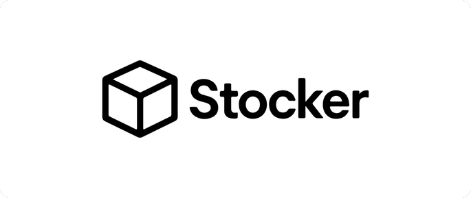

<div align="center">

# Stocker


</div>


Stocker es un gestor de inventarios diseñado para todas las empresas y negocios, tanto pequeños como grandes.

   <br>


<div align="center">
   


   
   
</div>

## Instalación

1. Clona el repositorio

   ```bash
   git clone https://github.com/martin-amaro/pi_web2
   ```

2. Accede al directorio

   ```bash
   cd pi_web2
   ```

3. Instala dependecias

   ```bash
   npm i
   ```

4. Genera el archivo `.env.local`
   ```bash
   cp .env.example .env.local
   ```

5. Genera una llave secreta para Auth.js

   ```bash
   npx auth secret
   ```

6. Ejecuta el proyecto

   ```bash
   npm run dev
   ```
   Podrás abrir el sitio en http://localhost:3000

### Backend

Para ejecutar este proyecto en su máxima capacidad, debes ejecutar el backend hecho con SpringBoot, disponible aquí.

[👉 Ir al repositorio del Backend](https://github.com/martin-amaro/pi_backend2)

### Autenticación con Google (opcional)

1. Para usar la autenticación con Google (OAuth), debes obtener las credenciales [`aquí`](https://console.cloud.google.com/projectselector2/apis/credentials).

2. Usarlas en el `.env.local`:

   ```bash
   GOOGLE_CLIENT_ID=
   GOOGLE_CLIENT_SECRET
   ```

### Pagos con Stripe (Opcional)

<div align="center">

</div>


1. Para usar el sistema de pago para la subscripción de planes, debes obtener las credenciales de Stripe [`aquí`](https://dashboard.stripe.com). 

2. Agregar credenciales en el `.env.local`:
   ```bash
   STRIPE_SECRET_KEY=
   NEXT_PUBLIC_STRIPE_PUBLIC_KEY=
   ```

3. Descargar [Stripe CLI](https://docs.stripe.com/stripe-cli/install?install-method=windows) y seguir las instrucciones que mencionan (registrar la variable de entorno, iniciar sesión, etc.)

4. Ejecutar el siguiente comando:

   ```bash
   stripe listen --forward-to localhost:3000/api/webhook
   ```
   
   Lo cual hará que se disparé el `webhook` al momento de hacer compras dentro de la aplicación.

5. Copiar el código del webhook (desde el comando anterior) y pegarlo en la siguiente sección del `.env.local`:

   ```bash
   STRIPE_WEBHOOK_SECRET=
   ```

## Tecnologías usadas

- [Next.js](https://nextjs.org/)
- [React](https://es.react.dev/)
- [Auth.js](https://authjs.dev/) (+ Google OAuth)
- [Stripe](https://stripe.com/es)

## Créditos

Desarrollado para [Cesde](https://www.cesde.edu.co/) por:
- Martín Amaro
- Daniel Múñoz
- Diego Cárdenas

</br>

-----

Stocker está basado e inspirado en [Square](https://squareup.com/us/en).